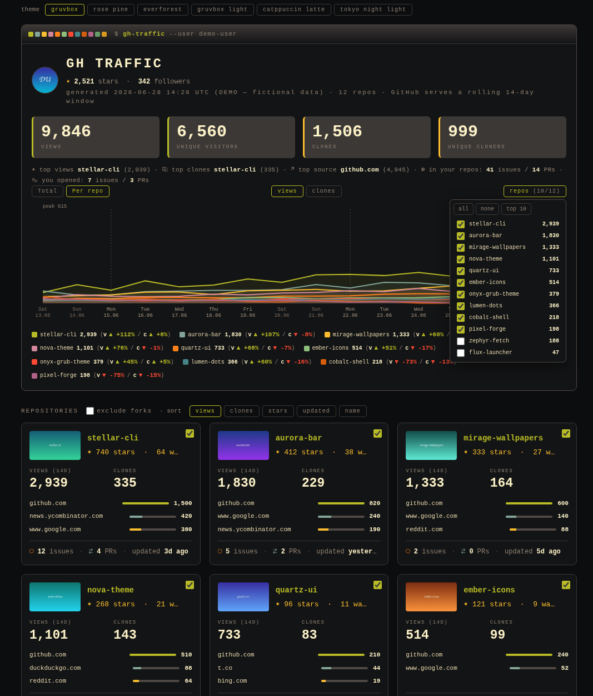
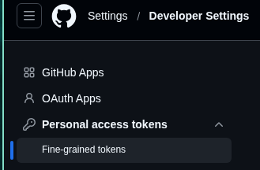
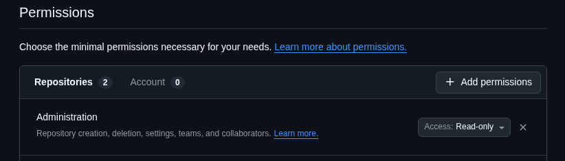

# GitHub Traffic Board

A **local**, single-file GitHub traffic dashboard. One stdlib-only Python script
pulls your repositories' traffic from the GitHub API and renders a single,
self-contained `report.html` — cumulative **and** per-repo charts, trend
analysis, referrers, preview thumbnails, six themes — that opens **fully
offline**.

```
python3 gh_traffic.py
```

No `pip install`, no dependencies, no build step, no telemetry, no account or
service beyond your own GitHub token.



> **▶ Live demo** (renders in your browser):
> **[full board](https://raw.githack.com/HANCORE-linux/GitHub-Traffic-Board/main/demo.html)** ·
> **[light mode](https://raw.githack.com/HANCORE-linux/GitHub-Traffic-Board/main/demo-light.html)**
> — fictional data, no token, no real data.
> *(These links go live the moment the repo is public. GitHub itself shows
> `.html` files as **source**, not as a page — so until then, download
> [`demo.html`](demo.html) and open it locally.)*

---

## Install

It's a single self-contained file — drop it into `~/gh-traffic/` and run it:

```bash
mkdir -p ~/gh-traffic && \
curl -fsSL https://raw.githubusercontent.com/HANCORE-linux/GitHub-Traffic-Board/main/gh_traffic.py \
     -o ~/gh-traffic/gh_traffic.py && \
python3 ~/gh-traffic/gh_traffic.py
```

The report and the cache land in that same `~/gh-traffic/` folder. **No
`chmod +x` needed** — it's run via `python3`. *(If you'd rather launch it as
`./gh_traffic.py`, run `chmod +x ~/gh-traffic/gh_traffic.py` once; the script
already carries a `#!/usr/bin/env python3` shebang.)*

---

## Two ways to run

On the first run (with no token configured) it asks:

```
  [F] full   — your repos' traffic · needs a GitHub token
  [l] light  — any user's public data · no token
  choose [F/l]:
```

- **Full** — your repos' 14-day **views / clones / referrers**, plus stars,
  watchers, issues/PRs and what *you* authored. Needs a fine-grained token (below).
- **Light** (`--public <user>`) — **any** GitHub user, **no token**: public
  metadata only (stars, issues, language, updated, thumbnails). **No traffic** —
  GitHub keeps views/clones/referrers private to the owner.

---

## Security — read this first

The GitHub Traffic API is **not** a harmless read-only scope: it requires
push-level trust on the repo. So mint the **smallest possible** token:

1. GitHub → Settings → Developer settings → **Fine-grained personal access tokens**.
2. **Repository access:** only the repos you want to see (or *All repositories*).
3. **Permissions:** `Administration → Read-only` (covers views, clones,
   referrers). *Optionally* `Pull requests → Read` so open-PR counts resolve
   (else shown as "?").
4. Set an **expiration**.

<p align="center">
  <br>
  <em>Settings → Developer Settings → Personal access tokens → <strong>Fine-grained tokens</strong></em>
</p>

<p align="center">
  <br>
  <em>Repository permissions → <strong>Administration → Read-only</strong> — the only permission needed</em>
</p>

*(A **classic** token would need the broad `repo` scope — full read/write to
**all** your private repos. Avoid it. Light mode needs no token at all.)*

How the token is handled:

- It lives **only in this process**, is sent **only** to `api.github.com`, and is
  **never written into `report.html`** *(verify: `grep -iE 'ghp_|github_pat_|bearer' report.html`)*.
- The report has **no external resources** — inline SVG, base64 images, no CDN or
  third-party JS — so it opens **fully offline**.
- **Prompted each run** by default (nothing stored). `--save-token` keeps it `0600`
  in `~/.config/gh-traffic/token` — outside the project folder, and gitignored.

---

<details>
<summary><strong>Features</strong></summary>

- **Cumulative chart** of views & clones across the repos you select, plus a
  **per-repo chart** (one line per repo) with a dropdown to pick *all / none /
  individual* repos.
- **Trend analysis** — every series shows ▲/▼ % comparing the recent half of the
  window against the prior half (per-repo: views **and** clones, side by side).
- **Referrers** — top referring sites per repo and aggregated across the board.
- **Per-repo cards** — preview image, stars, watchers, open issues / PRs
  (click-through to GitHub), and "updated *N*d ago", all the same height.
- **Six themes** (switch live, top-left): `gruvbox`, `rose pine`, `everforest`
  (dark) · `gruvbox light`, `catppuccin latte`, `tokyo night light` (light).
- **Preview thumbnails** — finds `preview.png` (or any top-level / `showcases/`
  image), downscales it, and embeds it base64 so the report stays offline.
- **Sort** by views / clones / stars / updated / name; **exclude forks** toggle.

</details>

<details>
<summary><strong>Flags</strong></summary>

| Flag | Effect |
|------|--------|
| `--public [USER]` | **light mode**: public data for `USER` (no token, no traffic) |
| `--out PATH` | output file (default: `~/gh-traffic/report.html`) |
| `--no-open` | don't open a browser |
| `--save-token` | save the entered token to `~/.config/gh-traffic/token` (0600) |
| `--repos a,b,c` | only these repo names |
| `--workers N` | parallel fetch workers (default: 8) |
| `--no-thumbs` | skip preview images (faster; all placeholders) |
| `--refresh-thumbs` | re-fetch preview images, ignoring the ETag cache |

</details>

<details>
<summary><strong>Where it stores data</strong></summary>

The output and cache live in **one tidy folder in your home directory** —
nothing is written into the cloned repo, and it's always in the same findable place:

```
~/gh-traffic/report.html    ← the generated board (--out to change)
~/gh-traffic/cache/thumbs/  ← downscaled preview images + ETags (re-used via HTTP 304)
~/.config/gh-traffic/token  ← only with --save-token (a secret, kept in XDG)
```

Every run is a **fresh 14-day snapshot** from the API — nothing is persisted but
the thumbnail cache. *Light mode* uses the unauthenticated API (**60 requests/h**);
a big scan with thumbnails can hit that — just re-run, thumbnails are cached.

</details>

<details>
<summary><strong>Demo</strong></summary>

GitHub shows `.html` as **source**, not a live page — so to view the demo *rendered*:

- **Public repo:** the [githack](https://raw.githack.com) links above render it in
  the browser (or enable GitHub Pages for a `github.io` URL).
- **Private / offline:** download [`demo.html`](demo.html) and open it locally.

Built from fictional data — no token, no network. Regenerate with `python3 make_demo.py`.

</details>

<details>
<summary><strong>Requirements</strong></summary>

- **Python 3.9+** — standard library only.
- **ImageMagick** (`magick` or `convert`) — *optional*, only for preview
  thumbnails. Without it, cards show monogram placeholders.

</details>

---

## Credits

This project started from **`github_traffic_report.py` by Roman Tsisyk** and was
rebuilt from there into a single stdlib-only file — a new fully-offline report,
six themes, trend analysis, a per-repo dropdown, light mode and more. Thanks to
Roman for the original.

---

## License

MIT — see [`LICENSE`](LICENSE).
